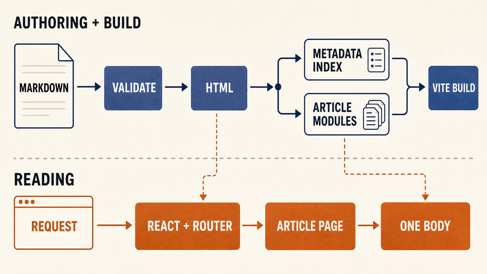

# Ponkcoding

[Ponkcoding](https://ponkcoding.com) is Rifan Fauzi's personal publication: engineering notes, AI workflows, product experiments, and practical field reports.

The site is designed around three constraints:

1. Keep a personal publication inexpensive to operate.
2. Preserve a small initial bundle and load content only when needed.
3. Use Markdown as a durable, reviewable source of truth for human- and AI-assisted writing.

The repository is public so the implementation can be read alongside [the article explaining how the site works](https://ponkcoding.com/articles/prerendering-a-markdown-blog).



## Stack

- React 18 and React Router 6
- TypeScript in strict mode
- Vite 5
- SCSS with CSS custom properties for runtime theming
- Markdown compiled with unified, remark, and rehype
- Build-time syntax highlighting with `rehype-highlight`
- Static hosting with an SPA fallback

There is no backend, database, CMS, authentication layer, or request-time content API.

## How it works

Markdown files in `content/articles/` are the content source. Before development and production builds, `scripts/generate-content-index.ts`:

1. Parses and validates frontmatter.
2. Excludes drafts from production.
3. Converts GitHub-flavored Markdown to HTML.
4. Generates heading IDs, table-of-contents data, and syntax highlighting.
5. Emits a metadata-only index plus one body module per article.

```text
content/articles/*.md
        │
        ▼
validate + compile Markdown
        │
        ├── src/generated/content-index.ts
        └── src/generated/articles/<slug>.ts
                         │
                         ▼
                    TypeScript + Vite
                         │
                         ▼
                       dist/
```

The browser architecture keeps those generated outputs separate:

- Home imports metadata only; article HTML never enters the Home chunk.
- Every page is loaded through `React.lazy`.
- Page SCSS is co-located and loaded with its route.
- The Article page uses `import.meta.glob` to fetch only the requested article body.
- Internal navigation stays client-side through React Router.

The current site is a client-rendered SPA. Content is compiled at build time, but complete route HTML is not prerendered yet.

## Local development

Requirements:

- Node.js 22
- npm

Install dependencies and start Vite:

```bash
npm ci
npm run dev
```

`npm run dev` regenerates content before starting the development server.

Create a production build:

```bash
npm run build
```

The build regenerates production content, type-checks with TypeScript, writes assets to `dist/`, and recompresses raster images in the output. Original files in `public/` are never modified.

## Commands

| Command                    | Purpose                                                        |
| -------------------------- | -------------------------------------------------------------- |
| `npm run dev`              | Generate content and start the Vite development server         |
| `npm run build`            | Generate content, type-check, build, and optimize `dist/`      |
| `npm run preview`          | Serve the production build locally with SPA fallback           |
| `npm run generate:content` | Regenerate `src/generated/` from Markdown                      |
| `npm run optimize:images`  | Recompress supported raster images already copied into `dist/` |
| `npm run format`           | Format the repository with Prettier                            |
| `npm run format:check`     | Verify formatting without modifying files                      |

## Writing an article

Create a Markdown file in `content/articles/` with this frontmatter:

```yaml
---
title: 'Article title'
slug: 'article-slug'
description: 'A concise summary.'
date: '2026-07-07'
category: 'Web Development'
tags:
  - react
  - vite
status: 'draft'
author: 'Rifan Fauzi'
featured: false
---
```

Required fields are validated during generation. Optional fields are `updated`, `cover`, and `featured`. A cover must be an absolute path to an asset in `public/`, such as `/images/articles/example.jpg`.

Use a fenced language identifier to enable syntax highlighting:

````markdown
```tsx
export function Example() {
  return <p>Hello</p>
}
```
````

Do not edit `src/generated/`. It is disposable build output and is excluded from Git.

## Project structure

```text
content/articles/               Markdown source
public/                         Static assets and host fallback rules
scripts/generate-content-index.ts
src/
├── components/                 Reusable UI primitives
├── generated/                  Generated metadata and article modules
├── lib/                        Shared types and helpers
├── pages/                      Lazy route components and co-located SCSS
├── styles/                     Global styles and design tokens
└── main.tsx                    Router, lazy routes, and application shell
```

## Performance rules

- Keep every route lazy-loaded.
- Never import generated article bodies statically.
- Keep page-specific SCSS inside its page folder.
- Avoid new runtime dependencies unless their bundle cost is justified.
- Review the Vite chunk-size table after every production build.
- Preserve React Router navigation for internal routes; do not use document-reloading links.

The shared React and router bundle is the practical baseline. Build-time Markdown tooling is kept in `devDependencies` and does not ship to readers.

## Deployment

Vite writes a static `dist/` directory. The host must rewrite unknown routes to `index.html` so direct visits to article, profile, and design-system URLs reach React Router.

The repository includes the Netlify-compatible rule in `public/_redirects`:

```text
/*  /index.html  200
```

## Roadmap

- Prerender public routes to static HTML
- Add lazy-loaded Pagefind search
- Generate `sitemap.xml` and `rss.xml`
- Add build-time custom Markdown blocks, including Mermaid diagrams
- Move projects and other static page data into content types when needed

See [AGENTS.md](AGENTS.md) for the complete engineering and content guidelines.
